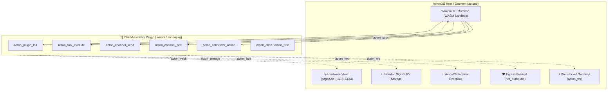

# ActonOS Plugin SDK Master Engineering Skill

This skill is the complete architectural reference, development handbook, and operational runbook for developing, maintaining, testing, and debugging plugins and the core SDK toolchain in the `ActonOS-Plugin-SDK` ecosystem.

---

## 1. System Topology & WebAssembly (WASM) Execution Model

ActonOS executes all plugins as WebAssembly (`wasip1` / `wasm32-wasi`) modules sandboxed inside the Wazero JIT runtime.



---

## 2. Host ABI Syscall Contracts & Imports

Plugins interact with ActonOS host capabilities via typed WebAssembly imports declared under the `acton_*` module namespace.

| Host Module | Function | Signature | Description |
|:---|:---|:---|:---|
| `acton_sys` | `log` | `(level: int32, ptr: uint32, len: uint32)` | Emit structured logs to ActonOS logger (`1=Debug`, `2=Info`, `3=Warn`, `4=Error`). |
| `acton_sys` | `read_response` | `(destPtr: uint32, destLen: uint32) -> int32` | Copy buffered host response from previous syscall into WASM linear memory. |
| `acton_net` | `http_request` | `(reqPtr: uint32, reqLen: uint32) -> uint32` | Execute sandboxed HTTP request (subject to `net_outbound` domain whitelist). |
| `acton_ws` | `ws_connect` | `(urlPtr, urlLen, hPtr, hLen: uint32) -> int32` | Open WebSocket connection to endpoint; returns connection `handleID` (or `-1`). |
| `acton_ws` | `ws_send` | `(handleID: int32, msgType: int32, dataPtr, dataLen: uint32) -> int32` | Send message over active WebSocket (`1=Text`, `2=Binary`). |
| `acton_ws` | `ws_poll` | `(handleID: int32) -> int32` | Non-blocking poll for incoming WebSocket frame (`>0=byteLen`, `0=empty`, `-1=closed`). |
| `acton_ws` | `ws_close` | `(handleID: int32) -> int32` | Terminate and release active WebSocket connection. |
| `acton_vault`| `get_secret` | `(keyPtr: uint32, keyLen: uint32) -> uint32` | Read hardware-encrypted credential from Vault (must match `permissions.secrets`). |
| `acton_storage`| `kv_get` | `(keyPtr: uint32, keyLen: uint32) -> uint32` | Fetch value from plugin's isolated SQLite key-value partition. |
| `acton_storage`| `kv_set` | `(kPtr, kLen, vPtr, vLen: uint32) -> int32` | Store key-value pair in SQLite storage. |
| `acton_storage`| `kv_delete` | `(keyPtr: uint32, keyLen: uint32) -> int32` | Remove key from SQLite storage. |
| `acton_bus` | `emit_event` | `(tPtr, tLen, pPtr, pLen: uint32) -> int32` | Publish event onto system event bus (must match `permissions.bus_events`). |

---

## 3. WASM Export Entrypoints & Linear Memory Management

Every compiled plugin binary exposes the following entrypoint ABI:

```go
// Linear memory allocators
//go:wasmexport acton_alloc
func acton_alloc(size uint32) uint32

//go:wasmexport acton_free
func acton_free(ptr uint32, length uint32)

// Lifecycle & Handlers
//go:wasmexport acton_plugin_init
func acton_plugin_init() int32

//go:wasmexport acton_tool_execute
func acton_tool_execute(namePtr uint32, nameLen uint32, argsPtr uint32, argsLen uint32) uint64 // Returns packed (ptr << 32 | len)

//go:wasmexport acton_channel_send
func acton_channel_send(ptr uint32, length uint32) int32

//go:wasmexport acton_channel_poll
func acton_channel_poll() uint64 // Returns packed (ptr << 32 | len)

//go:wasmexport acton_connector_action
func acton_connector_action(ptr uint32, length uint32) uint64 // Returns packed (ptr << 32 | len)
```

---

## 4. Core SDK Development Patterns

### 4.1. Typed Agent Tools (`sdk.Tool`)
Tools are callable functions exposed to ReAct Agent swarms with automatic JSON schema generation:

```go
type WeatherInput struct {
    City  string `json:"city" jsonschema:"title=City Name,description=Target city,required"`
    Units string `json:"units" jsonschema:"title=Units,enum=celsius|fahrenheit,default=celsius"`
}

func init() {
    tool := sdk.NewTypedTool("get_weather", "Fetch current weather", func(ctx sdk.Context, in WeatherInput) (*sdk.ToolResult, error) {
        resp, err := ctx.HTTP().Get("https://api.weather.com/" + in.City)
        if err != nil {
            return sdk.NewResultError(err.Error()), nil
        }
        return sdk.NewResultData("Success", map[string]any{"city": in.City}), nil
    })
    sdk.RegisterTool(tool)
}
```

### 4.2. Chat Channels with Multi-Bot & Real-time WebSocket (`sdk.ChannelAdapter`)
Channel adapters connect external messaging services with ActonOS agent swarms:

```go
type MyConfig struct {
    Accounts []MyAccount `json:"accounts"`
}

type MyAccount struct {
    sdk.ChannelAccount
}

type MyChannel struct {
    sdk.BaseChannel
}

func (c *MyChannel) SendMessage(ctx sdk.Context, msg sdk.OutboundMessage) error {
    token, _ := ctx.Vault().GetSecret("tokens." + msg.AccountID)
    // Send message via ctx.HTTP() or active WebSocket...
    return nil
}

func (c *MyChannel) PollMessages(ctx sdk.Context) ([]sdk.InboundMessage, error) {
    var cfg MyConfig
    _ = ctx.Config().Bind(&cfg)
    
    // Connect / Poll stream via ctx.WS() or webhook events
    // Parse @agent mentions via sdk.ExtractAgentMention
    return inbounds, nil
}
```

### 4.3. SaaS Connectors & Agent Tool Bridging (`sdk.Connector`)
Connectors integrate external SaaS APIs and bridge their actions as callable Tools:

```go
func init() {
    conn := sdk.NewBaseConnector("github", "GitHub", "oauth2").
        WithSecretKey("github_access_token")

    sdk.RegisterTypedAction(conn, "list_repos", "List repositories", func(ctx sdk.Context, in ListInput) (any, error) {
        token, _ := conn.GetAuthToken(ctx)
        resp, err := ctx.HTTP().GetWithBearer("https://api.github.com/user/repos", token)
        return resp, err
    })

    sdk.RegisterConnector(conn)

    // Bridge all connector actions as ReAct Agent Tools!
    for _, tool := range conn.AsTools() {
        sdk.RegisterTool(tool)
    }
}
```

---

## 5. Schema-Driven Manifest (`manifest.json`) Standards

Plugin manifests MUST adhere to `spec/MANIFEST_SCHEMA.json` (JSON Schema Draft-07):

```json
{
  "id": "channel-discord",
  "name": "Discord Bot Channel",
  "version": "2.0.0",
  "description": "Discord Bot integration for ActonOS AI agents",
  "author": "ActonOS Core Team",
  "license": "MIT",
  "capabilities": ["channel"],
  "permissions": {
    "net_outbound": ["discord.com", "gateway.discord.gg"],
    "secrets": ["discord_bot_tokens.*"],
    "storage": true,
    "bus_events": ["channel.discord.received", "channel.discord.sent"]
  },
  "config_schema": {
    "type": "object",
    "properties": {
      "poll_interval_seconds": {
        "type": "integer",
        "title": "Polling Interval (seconds)",
        "default": 3,
        "x-ui-group": "General Settings"
      },
      "accounts": {
        "type": "array",
        "title": "Discord Bot Accounts",
        "x-ui-group": "Bot Accounts",
        "items": {
          "type": "object",
          "required": ["account_id", "bot_token", "default_agent"],
          "properties": {
            "account_id": {
              "type": "string",
              "title": "Account ID",
              "pattern": "^[a-z0-9_-]+$",
              "x-ui-placeholder": "bot_support"
            },
            "bot_token": {
              "type": "string",
              "title": "Bot Token",
              "x-secret": true,
              "x-ui-widget": "password"
            },
            "default_agent": {
              "type": "string",
              "title": "Default Agent",
              "x-ui-widget": "agent-selector"
            },
            "enable_typing_indicator": { "type": "boolean", "default": true },
            "enable_ack_reaction": { "type": "boolean", "default": true },
            "enable_reply_quote": { "type": "boolean", "default": true },
            "ack_reaction_emoji": { "type": "string", "default": "👀" }
          }
        }
      }
    }
  }
}
```

### UI Schema Attributes Reference:
- `x-secret: true` $\rightarrow$ Tells ActonOS to encrypt and store value in **Hardware Vault** (`vault.db`).
- `x-ui-widget` $\rightarrow$ Hints frontend form controls (`"password"`, `"agent-selector"`, `"textarea"`, `"slider"`).
- `x-ui-group` $\rightarrow$ Groups fields into collapsible UI sections.
- `x-ui-placeholder` $\rightarrow$ Input placeholder text.
- `x-order` $\rightarrow$ Numeric sorting priority in form renderer.

---

## 6. CLI Toolchain Runbook (`acton-plugin`)

The CLI toolchain in `cmd/acton-plugin/` manages the complete development lifecycle:

```bash
# 1. Build plugin into WebAssembly binary (wasip1)
go run ./cmd/acton-plugin build -src ./plugins/channels/discord -out dist/channel-discord.wasm

# 2. Validate manifest against spec/MANIFEST_SCHEMA.json
go run ./cmd/acton-plugin validate -manifest ./plugins/channels/discord/manifest.json

# 3. Test plugin headless execution in MockHost sandbox
go run ./cmd/acton-plugin test -wasm dist/channel-discord.wasm

# 4. Package into production distributable .actonpkg bundle
go run ./cmd/acton-plugin pack -manifest ./plugins/channels/discord/manifest.json -wasm dist/channel-discord.wasm -out dist/channel-discord.actonpkg
```

---

## 7. Testing & Diagnostic Procedures

### 7.1. Running Unit & Integration Tests
```bash
# Test core SDK
go test -v ./sdk/...

# Test Host runner and WASM sandboxing
go test -v ./host/...

# Test all plugins and connectors
go test -v ./plugins/... ./examples/...
```

### 7.2. Troubleshooting Common Issues
1. **`domain not permitted in manifest net_outbound`**:
   - Verify the request URL domain is explicitly listed in `permissions.net_outbound` in `manifest.json`.
2. **`missing secret ... in vault`**:
   - Check if secret key pattern is declared in `permissions.secrets` (e.g. `discord_bot_tokens.*`).
3. **`WASM memory read/write overflow`**:
   - Ensure linear memory buffers allocated with `abi.BytesToPtr` are appropriately sized and freed with `abi.Free`.
4. **`WebSocket connection closed (-1)`**:
   - Check if remote server requires custom headers or token handshake before dispatching frames.
